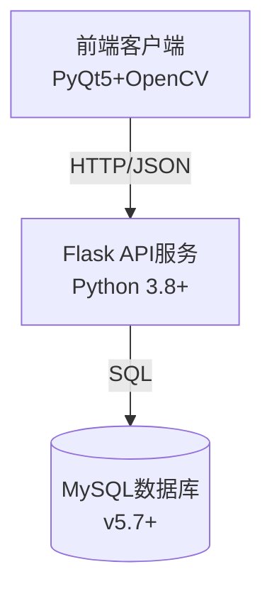

# 火灾报警管理系统

## 目录
- [项目简介](#项目简介)
- [功能特性](#功能特性)
  - [核心功能](#核心功能)
  - [管理功能](#管理功能)
- [技术架构](#技术架构)
- [安装指南](#安装指南)
  - [前置要求](#前置要求)
  - [后端部署](#后端部署)
  - [前端部署](#前端部署)
- [使用说明](#使用说明)
- [API文档](#api文档)
- [系统限制](#系统限制)
- [常见问题](#常见问题)
- [开发路线](#开发路线)
- [贡献指南](#贡献指南)
- [许可证](#许可证)

## 项目简介

智能火灾检测管理系统是一套基于计算机视觉和Web技术的综合解决方案，主要功能包括：

- 实时视频流火焰检测
- 报警事件记录与管理
- 多维度数据分析
- 分级权限控制系统

适用场景：校园、工厂、仓库等需要火灾监控的场所。

## 功能特性

### 核心功能

| 功能模块       | 详细描述                                                                 |
|----------------|--------------------------------------------------------------------------|
| 实时监控       | 支持RTSP/HTTP视频流接入，实时分析画面                                    |
| 智能检测       | 基于HSV色彩空间的火焰识别算法，可调灵敏度                                |
| 报警管理       | 自动记录报警时间、位置、截图，支持人工确认/误报标记                      |
| 数据可视化     | 动态展示报警统计图表（柱状图、趋势图等）                                 |
| 地图展示       | 粗略的地图截图，为了保存界面的完整性                               |

### 管理功能

| 功能模块       | 权限要求   | 详细描述                                                                 |
|----------------|------------|--------------------------------------------------------------------------|
| 用户管理       | 管理员     | 用户增删改查，角色分配（管理员/普通用户）                                |
| 报警处理       | 管理员     | 批量处理报警，误报剔除，处理记录追踪                                     |
| 系统配置       | 管理员     | 摄像头参数设置，检测灵敏度调整                                           |
| 数据导出       | 管理员     | 支持Excel/CSV格式导出报警历史数据                                        |

## 技术架构

### 系统组件



### 技术栈
- **前端**：PyQt5 + QSS + OpenCV
- **后端**：Flask + PyMySQL + JWT
- **算法**：OpenCV图像处理
- **数据库**：MySQL关系型数据库

## 安装指南

### 前置要求

- 硬件要求：
  - CPU: Intel i5 4代以上
  - 内存: 8GB+
  - 存储: 100MB可用空间
  - 摄像头: 支持RTSP/HTTP协议

- 软件要求：
  - Python 3.8+
  - MySQL 5.7+
  - FFmpeg (视频处理)

### 后端部署

1. 克隆仓库：
```bash
git clone https://github.com/huubao-hub/huoyan.git
cd huoyan
``` 
2. 创建虚拟环境并激活：
```bash
python -m venv venv
source venv/bin/activate  # 在Linux/MacOS上
venv\Scripts\activate  # 在Windows上
```
3. 安装依赖：
```bash 
pip install -r requirements.txt
```

4. 配置数据库连接：
   - 修改 `client.py` 中的数据库配置
   - 创建数据库并导入 

5. 启动Flask服务：
```bash 
python server.py
``` 

### 前端部署
1. 安装前端依赖：
```bash
pip install -r requirements.txt
```
2. 启动前端应用：
```bash 
python client.py
``` 

### 使用说明
1. 登录:
    - 打开前端应用，在登录界面输入用户名和密码进行登录。系统提供管理员和普通用户两种角色，不同角色拥有不同的操作权限。

2. 实时监控:

    - 登录成功后，进入实时监控页面。在该页面可以选择要监控的摄像头，查看实时视频流。系统会自动对视频画面进行火焰检测，若检测到火焰，会触发报警。

3. 报警管理:
   - 在报警管理页面，可以查看所有报警记录，包括报警时间、位置、截图等信息。
   - 管理员可以对报警进行确认或标记为误报，并添加处理备注。 

4. 数据可视化：
    - 在数据可视化页面，可以查看报警统计图表，包括报警次数、趋势等信息。支持按时间范围筛选。

5. 地图展示：
   - 在地图展示页面，可以查看报警位置标记。点击标记可以查看报警详情。

6. 管理功能：
   - 管理员可以在用户管理页面添加、删除或修改用户信息，分配角色权限。
   - 在系统配置页面，可以调整摄像头参数和检测灵敏度。

### API文档
- **获取摄像头列表**
  - **URL**: `/api/cameras`
  - **方法**: `GET`
  - **参数**: 无
  - **返回**: 摄像头信息列表
- **获取实时视频流**
  - **URL**: `/api/stream/<camera_id>`
  - **方法**: `GET`
  - **参数**: `camera_id` - 摄像头ID
  - **返回**: 实时视频流数据
- **触发报警**
    - **URL**: `/api/alert`
    - **方法**: `POST`
    - **参数**: 
        - `camera_id` - 摄像头ID
        - `timestamp` - 报警时间戳
        - `location` - 报警位置
    - **返回**: 报警记录ID
- **确认报警**
    - **URL**: `/api/alert/confirm`
    - **方法**: `POST`
    - **参数**: 
        - `alert_id` - 报警记录ID
        - `user_id` - 确认用户ID
    - **返回**: 确认结果
- **获取报警记录**
    - **URL**: `/api/alerts`
    - **方法**: `GET`
    - **参数**: 
        - `start_date` - 起始日期
        - `end_date` - 结束日期
    - **返回**: 报警记录列表

## 系统限制
- 仅支持RTSP/HTTP协议的视频流接入
- 目前仅支持单摄像头实时监控
- 数据可视化功能需要至少1个月的报警数据才能生成统计图表
- 地图展示功能需要配置地图API密钥

## 常见问题
### Q1: 无法登录系统？
A1: 请检查以下事项：
- 确保用户名和密码正确无误。
- 检查网络连接是否正常。
- 如果问题仍然存在，请联系系统管理员。

### Q2: 实时视频流无法显示？
A2: 请检查以下事项：
- 确保摄像头已正确连接并支持RTSP/HTTP协议。
- 检查摄像头地址是否正确配置。
- 确保FFmpeg已正确安装并配置。
### Q3: 报警信息未记录？
A3: 请检查以下事项：
- 检查系统配置中的检测灵敏度是否设置正确。
- 检查数据库连接是否正常。

## 开发路线
- **短期目标**（1-3个月）：
  - 完善现有功能，修复已知BUG
  - 增加多摄像头支持
  - 优化数据可视化界面
- **中期目标**（3-6个月）：
    - 引入机器学习算法提升火焰检测准确率
    - 增加报警通知功能（短信/邮件）
    - 支持多语言界面
- **长期目标**（6个月以上）：
    - 开发移动端应用
    - 集成云存储服务实现数据备份
    - 支持AI智能分析（如烟雾检测、温度异常等）

## 贡献指南
欢迎任何形式的贡献！请遵循以下步骤：
1. Fork本仓库
2. 创建新分支 (`git checkout -b feature/your-feature`)
3. 提交更改 (`git commit -m 'Add some feature'`)
4. 推送到分支 (`git push origin feature/your-feature`)
5. 创建Pull Request

## 许可证
本项目采用MIT许可证，详情请参阅 [LICENSE](LICENSE) 文件。
